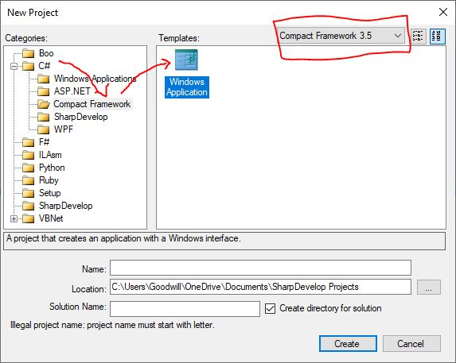

# Windows CE Development Pack

This repository contains all the resources and documentation you need to set up a Windows CE development environment without Visual Studio 2008. The setup uses SharpDevelop 3.2 as the IDE and includes:
  
- **.NET Framework 3.5 (includes .NET 2.0 and 3.0):**  
  Ensure this Windows feature is enabled on your system.
  
- **.NET Compact Framework 3.5 Redistributable:**  
  A redistributable package needed for Windows CE development (available as a release asset).
  
- **Power Toys for .NET Compact Framework 3.5:**  
  Additional tools to help with development (available as a release asset).
  
- **Beckhoff VirtualBox VM:**  
  A pre-configured virtual machine to assist in development (available as a release asset).

## Prerequisites

- A Windows machine that can enable Windows Features.
- **Enable the Windows Feature:**  
  `.NET Framework 3.5 (includes .NET 2.0 and 3.0)`  
  To enable, go to **Control Panel > Programs and Features > Turn Windows features on or off**, then check the appropriate box.
- [SharpDevelop 3.2](https://sourceforge.net/projects/sharpdevelop/files/SharpDevelop%203.x/3.2/) installed.
- [VirtualBox](https://www.virtualbox.org/) (for running the Beckhoff VM).

## Setup Instructions

1. **Enable .NET Framework 3.5:**
   - Open Control Panel.
   - Navigate to **Programs and Features**.
   - Click **Turn Windows features on or off**.
   - Check **.NET Framework 3.5 (includes .NET 2.0 and 3.0)** and click **OK**.

2. **Install SharpDevelop 3.2:**
   - Download and install SharpDevelop 3.2 from your preferred source or go to the [Releases](https://github.com/fisothemes/windows-ce-development-pack/releases) section of this repository.

3. **Download Required Binaries:**
   - Go to the [Releases](https://github.com/fisothemes/windows-ce-development-pack/releases) section of this repository.
   - Download the following assets:
     - **.NET Compact Framework 3.5 Redistributable**
     - **Power Toys for .NET Compact Framework 3.5**
     - **Beckhoff Windows CE VirtualBox VM**

4. **Set Up the Beckhoff VM:**
   - Install VirtualBox on your machine.
   - In VirtualBox, choose **File > Import Appliance...**.
   - Select the Beckhoff VM file you downloaded.
   - Follow the prompts to complete the VM import.

5. **Start Development:**
   - Open SharpDevelop 3.2.
   - Click **File > New > Solution...**.
   - Under the **Categories** section, select **C#**, click **Compact Framework** and select the **Windows Application** template.

        

   - Configure your projects as needed.
   - Refer to the documentation in the `docs` folder for further configuration tips.

## Download Links
If you don't prefer to use GitHub, you can download the assets from the following links:

- [SharpDevelop 3.2 (SourceForge)](https://sourceforge.net/projects/sharpdevelop/files/SharpDevelop%203.x/3.2/)
- [Beckhoff Windows CE VirtualBox VM (Beckhoff)](https://download.beckhoff.com/download/software/embPC-Control/Solutions/VM_WindowCE_WEC7)
- [.NET Compact Framework 3.5 Redistributable (Legacy Update)](https://legacyupdate.net/download-center/download/65/.net-compact-framework-3.5-redistributable)
- [Power Toys for .NET Compact Framework 3.5 (Legacy Update)](https://legacyupdate.net/download-center/download/13442/power-toys-for-.net-compact-framework-3.5)
- [Microsoft Device Emulator (Legacy)](https://legacyupdate.net/download-center/download/5352/microsoft-device-emulator-3.0-standalone-release)

### Additional resources
- [Dissecting a C# Application: Inside SharpDevelop](https://web.archive.org/web/20070121151050/http://www.apress.com/free/content/Dissecting_A_CSharp_Application.pdf)
  - [Accompanying resources](https://web.archive.org/web/20070120003019/http://support.apress.com/1861008171/sharpdevelop_wroxedition.zip)

## For the Beckhoff Devs

For those of you who want to develop for Beckhoff devices using TwinCAT ADS, simply add the `TwinCAT.Ads.dll` .NET Assembly reference located at `C:\TwinCAT\AdsApi\.NET\CE\v2.0\` to your project.

## Known Issues

There are known issues with the Windows Mobile Forms Designer. See the official [wiki](https://github-wiki-see.page/m/icsharpcode/SharpDevelop/wiki/Compact-Framework-Development) for more details.

In short, with SharpDevelop 3.2:
- The Form Designer may generate .NET code containing properties not supported by the Compact Framework. After editing in the designer, some auto-generated lines or keywords (e.g., `PerformLayout()`) might need to be removed manually.
- Many controls available in the left panel may be added but then cause compiler errors.
- The Form Designer has no support for the `MainMenu` class (which is superseded by `MenuStrip` in the regular .NET Framework), meaning menu code often needs to be written manually.

A forum discussion with more details is available on the [Internet Archive](https://web.archive.org/web/20190815144708/http://community.sharpdevelop.net/forums/t/8893.aspx).

## Contributing

Contributions to improve documentation are welcome! Please open an issue or submit a pull request for review.

## Discussion

I have opened up the discussion tab for further conversations.
